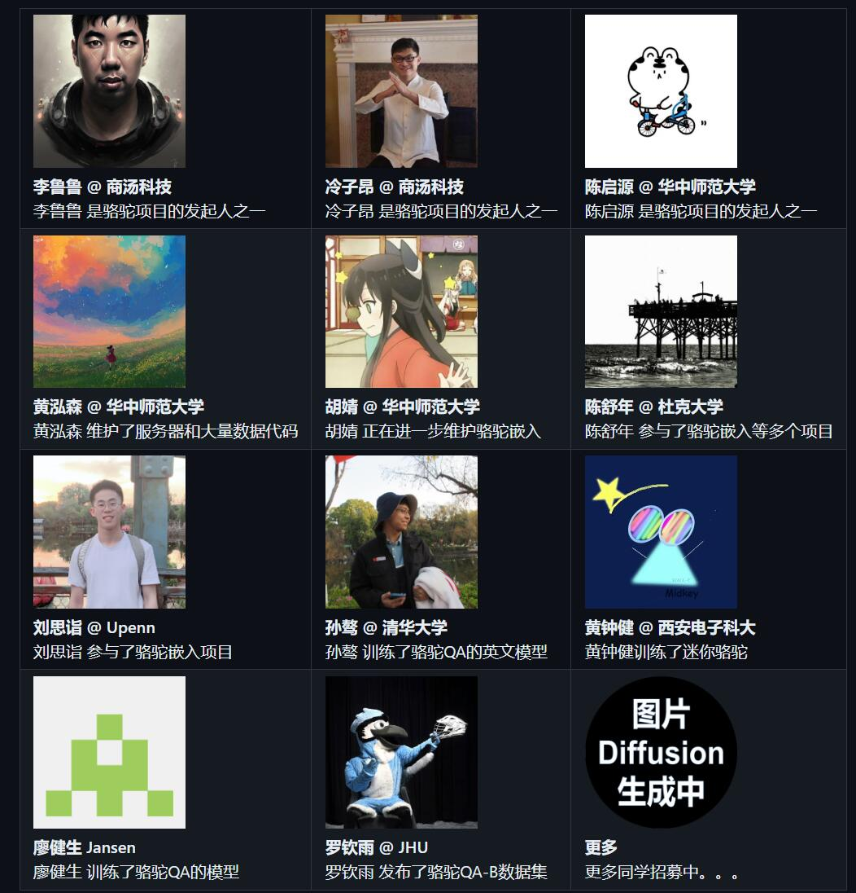
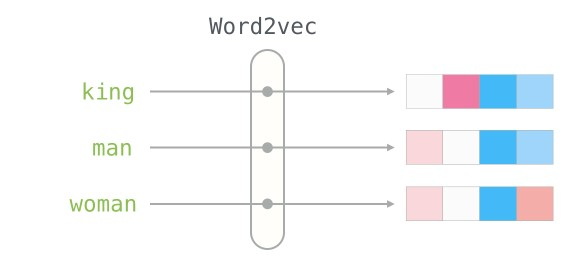
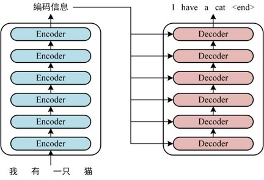
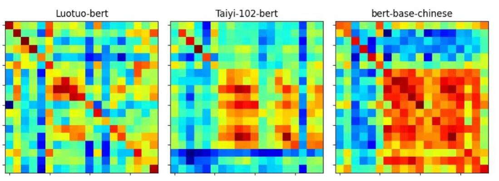
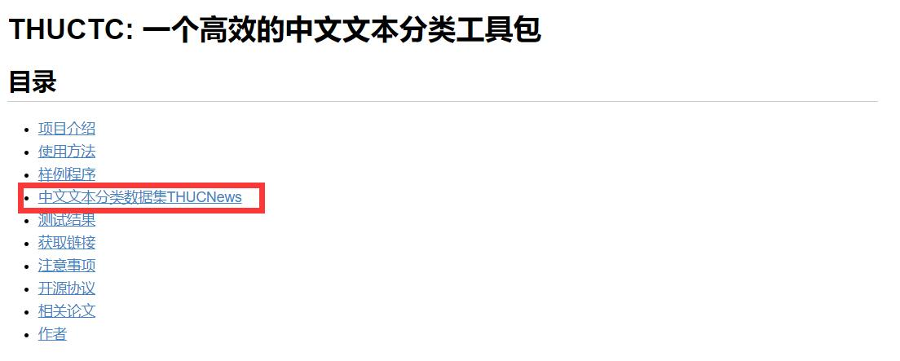
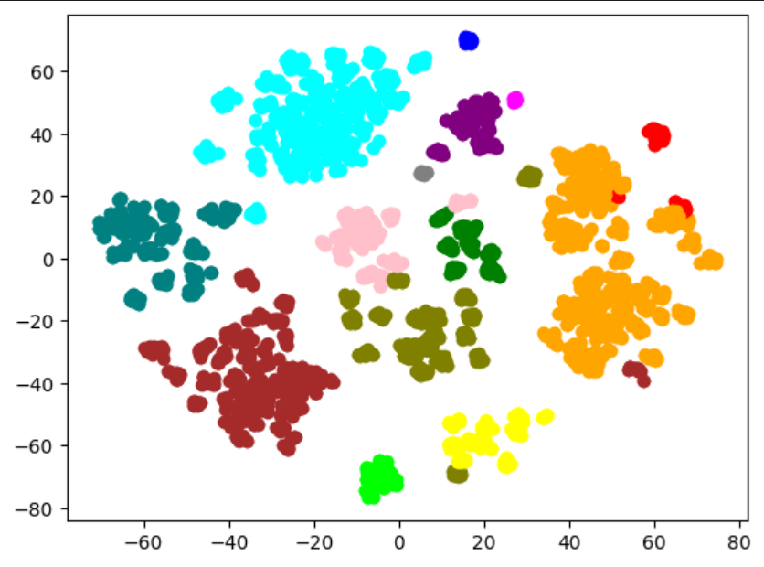
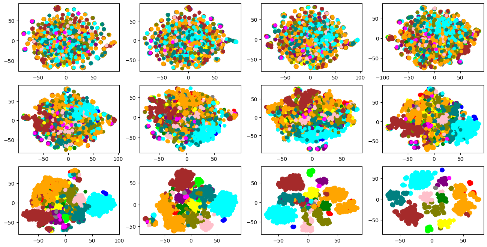
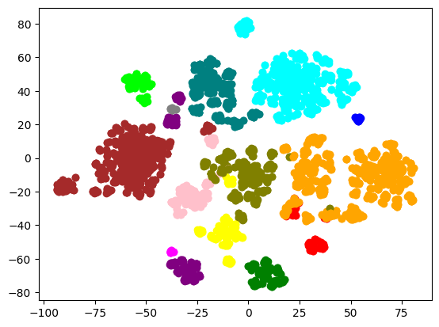

# 基于Bert模型的新闻标题分类

[TOC]

## 1 项目简介

短文本分类是自然语言处理中一个重要的任务，它可以应用于各种场景，如情感分析、垃圾邮件过滤、用户意图识别等。`BERT`是目前自然语言处理领域最为流行的深度学习模型之一，具有强大的表达能力和极高的性能。`Luotuo-BERT`是基于`BERT`改进而来的中文预训练模型，相对于`BERT-base-Chinese`，增加了一个全连接层使得`BERT`的特征能够提升到`1536`维，因此具有更好的性能表现。故本项目对模型进行应用,旨在比较`Luotuo-BERT`和`BERT-base-Chinese`在短文本分类预测上的性能表现，基于新闻标题分类问题进行实践。

## 2 项目背景

[骆驼](https://github.com/LC1332/Luotuo-Chinese-LLM)`Luotuo`是由

* 李鲁鲁 @ 商汤科技 
* 冷子昂 @ 商汤科技
* 陈启源 @ 华中师范大学 

发起的中文大语言模型开源项目,包含了一系列预训练语言模型,现在已经有多位同学与感兴趣的开发者加入到了这个开源项目中.

我们的主要任务集中在`Luotuo Embedding`[骆驼嵌入](<https://github.com/LC1332/Luotuo-Text-Embedding>),对`Luotuo`文本嵌入的模型进行使用和性能比较,为`Luotuo`模型在实际应用中做出一定的贡献.

文本嵌入，是指将一段文本，转化为一定维度的向量，其中相近语义、相关主题的文本在向量空间更接近。拥有一个良好的文本嵌入特征，对于文本可视化、检索、聚类、内容审核等下游任务，有着重要的意义。常见的文本嵌入模型包括

* 基于**传统特征工程**和机器学习算法
* 基于**词向量和浅层神经网络**,如词向量模型`Word2Vec`和浅层神经网络模`MLP`等
* 基于**递归神经网络**(`RNN`)和长短期记忆(`LSTM`),如`ELMo`
* 基于**预训练**的语言模型：`GPT`,`BERT`

本项目的主要内容是`Luotuo-BERT`与`BERT-base-Chinese`在**短文本分类预测**上的性能比较.

## 3 模型介绍

### 3.1 早期算法

在早期的算法中(例如`word2vec`)都将相同的预训练向量分配给同一个词，而不考虑词的上下文.在很多情况下这都有极大的局限性,比如英文文本中

* `a crane is flying.`一只鹤在飞.
* `a crane driver came.`一名吊车司机来了.

在含有一词多义的文本中均会出现上下文相关的不同表示.这推动了“上下文敏感”词的发展，词的含义取决于它们的上下文.

研究者们在循环神经网络(`RNN`)和长短期记忆网络(`LSTM`)的基础上提出了`ELMo`,使用多层`LSTM`和多任务学习的方式进行预训练，实现了双向编码。

但是`ELMo`仍然依赖于一个特定于任务的架构，为每一个特定任务均设计模型是不可接受的，并不能做到较好的通用性。

而`Transformer`的注意力机制更自然的解决了处理长序列数据的问题.可以不考虑先后顺序的情况下直接获取序列中各个元素之间的关系,并行的计算,增强了其表现和泛化能力。这使得任务无关的文本训练成为了可能，诞生了`GPT`.

但是`GPT`只能从左到右编码上下文，在部分文本处理领域上仍旧效果不佳.

### 3.2 BERT

`BERT`(`Bidirectional Encoder Representations from Transformers`)是一个由`Google`开发的预训练语言模型，它是一种基于`Transformer`架构的双向编码器。`BERT`在自然语言处理领域中取得了巨大的成功，它在`GPT`和`ELMo`的基础上结合了两个优点,可以在无需任何任务特定的特征工程的情况下，通过对大量文本数据进行预训练，得到通用的句子语义表示。

下图为`ELMo`、`GPT`和`BERT`之间的差异。

BERT将这些任务分为以下几个大类

* 单一文本分类
* 文本对分类
* 问答
* 文本标记

在预训练和`fine-tuning`阶段进行微调即可适应绝大多数任务.

`BERT`会根据输入自适应的调整输入模式.包含特殊字符`<cls>`和`<sep>`进行分隔和连结.

预训练包含两个任务,套用掩蔽语言模型和下一句预测.

最后得到目标的预训练模型.

`BERT-base-Chinese`是`BERT`的中文模型,由谷歌公司发布并[开源](https://huggingface.co/bert-base-chinese).

### 3.3 Luotuo-BERT

`Luotuo-BERT`是基于`BERT`改进而来的中文预训练模型，相对于`BERT-base-Chinese`，增加了一个全连接层使得`BERT`的特征能够提升到`1536`维，因此具有更好的性能表现。

在预训练模型时主要测试的是`Luotuo-BERT`的文本对分类功能.将部分歌词切分后作为输入,主要考验比较写意的文本对预测.利用`TSNE`绘制结果得到

快速上手[实例](https://colab.research.google.com/github/LC1332/Luotuo-Text-Embedding/blob/main/notebook/Luotuo_Embedding_Visualization.ipynb)

在歌词和新闻上表现良好,以下是各模型的表现对比

相比于新闻测试，歌词测试要难得多。即使是人类来观察也很难看出明显的相关性。通过蒸馏学习，`Luotuo-BERT`已经能够有一定的识别能力.

同时有一些同歌手、相近主题的歌曲，会出现分块相关的情况。

但是`Luotuo-BERT`主要在长文本对的数据集上进行预训练和测试,在短文本上进行的实验较少.

我们的工作就是在**短文本数据集**上测试`Luotuo-Bert`和`BERT-base-Chinese`模型的性能差别.

## 4 模型应用工作

### 4.1 训练环境

`pytorch1.10-cuda10.2-cudnn7-ubuntu18.04`

`GPU: 1*V100(32GB)|CPU: 8核 64GB`

### 4.2 数据集

`THUCNews`是根据新浪新闻订阅频道`2005~2011`年间的历史数据筛选过滤生成，包含`74`万篇新闻文档（`2.19 GB`），均为`UTF-8`纯文本格式。我们在原始新浪新闻分类体系的基础上，重新整合划分出`14`个候选分类类别：财经、彩票、房产、股票、家居、教育、科技、社会、时尚、时政、体育、星座、游戏、娱乐。

[下载地址](http://thuctc.thunlp.org/#%E4%B8%AD%E6%96%87%E6%96%87%E6%9C%AC%E5%88%86%E7%B1%BB%E6%95%B0%E6%8D%AE%E9%9B%86THUCNews)

### 4.3 数据可视化

`BERT`

最终结果

每一层的输出

`Luotuo-BERT`

